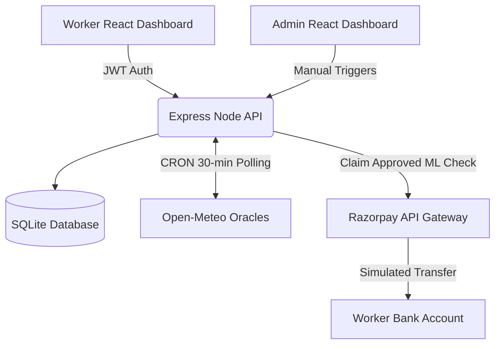

<div align="center">

# 🛡️ Guidewire Project: GigShield
**AI-Powered Parametric Insurance for India's Gig Economy**

[](https://reactjs.org/)
[](https://nodejs.org/)
[](https://expressjs.com/)
[](https://www.sqlite.org/)
[](#)

*Zero-touch parametric insurance built custom for food delivery partners to protect against income loss from weather and municipal disruptions.*

</div>

---

## 👥 Persona & The Problem
**Target User**: Rajesh, a Delivery Partner in Chennai earning ₹3,500/week.  
**The Problem**: During heavy monsoons or extreme heatwaves, Rajesh cannot deliver food. He loses daily wages and receives no compensation from delivery platforms.  
**The Solution**: With **GigShield**, Rajesh pays a micro weekly premium (e.g., ₹49/week). When the meteorological department (OpenWeather) flags >10mm of rainfall, GigShield's background cron engine automatically intercepts the trigger and instantly deposits the payout directly to Rajesh's UPI. **No manual claim filing required.**

---

## 💸 Dynamic Weekly Premium Model
Insurance pricing is inherently dynamic and calculated weekly based on an AI-driven predictive ML model. Coverage uniquely focuses on **Income Loss only**.

#### Base Tier Options
- 🥉 **Basic**: `₹29/week` → covers up to `₹500` income loss
- 🥈 **Standard**: `₹49/week` → covers up to `₹1,000` income loss
- 🥇 **Premium**: `₹79/week` → covers up to `₹2,000` income loss

#### 🧠 AI Dynamic Adjustments (Rule-based Multipliers):
- **Zone Risk History:** +10% to +25% depending on local flood/heat data.
- **7-Day Weather Forecast:** +5% to +20% adjustment using live meteorological prediction.
- **Worker Claim History:** 0 claims = -10% loyalty discount.
- **AQI Penalty:** City AQI > 300 = +15%.
*(Weekly Premium = Base × Zone multiplier × Weather multiplier × History multiplier)*

---

## ⚡ Parametric Triggers (Automated Oracles)
Claims are 100% automated using external third-party oracles. Polling runs every 30 minutes in the background.

1. 🌧️ **Heavy Rain**: Rainfall > 10mm in 24 hours (OpenWeatherMap API) → *50% daily wage payout*
2. 🌡️ **Extreme Heat**: Temps > 42°C (OpenWeatherMap API) → *30% daily wage payout*
3. 😷 **Severe Air Pollution**: AQI > 150 (Open-Meteo API) → *40% daily wage payout*
4. 🚨 **Flood / Natural Disaster**: IMD Red Alert mapped to zone → *100% weekly coverage*
5. 🚧 **Curfew / App Outage**: Admin triggers social disruption event → *100% daily wage payout*

---

## 🛡️ Intelligent Fraud Detection
GigShield incorporates a multi-layer fraud scoring engine (0-100 score) before greenlighting simulated Razorpay transactions:
- **Velocity Check**: Auto-flags if > 3 claims are filed in a single week.
- **Duplicate Claim Prevention**: Prevents duplicate claims for the same event type within 24 hours.
- **Income Anomaly**: Flags if the calculated payout ratio exceeds the registered maximum weekly earnings.
- **Instant vs Manual**: Score `0-30` = Auto-Approve. Score `31-60` = Auto-Hold (Secondary Review). Score `61+` = Auto-Reject.

---

## 💻 Tech Stack & Architecture

- **Frontend**: React.js (Vite), Tailwind CSS, Chart.js for analytics, Lucide Icons, React Leaflet logic.
- **Backend**: Node.js, Express.js.
- **Database**: SQLite (SQL) with automated indexing.
- **Integrations**: Open-Meteo API (Live Weather & AQI), Razorpay Test Mode (Simulated Payment Gateway).
- **Security**: JWT Authentication, bcrypt password hashing, Helmet.js.

### System Diagram


---

## 🚀 Local Setup & Initialization

> **Important:** Always start the backend server **before** accessing the frontend. The admin dashboard and worker dashboard both depend on the backend API running on port 5000.

### 1. Database & Backend Server
```bash
cd backend
npm install
node server.js
```
*The backend automatically creates and seeds `schema.sql` into a fresh SQLite file on first run. The environment is pre-seeded with 50 mock workers, sample policies, and historical events to immediately populate the Admin graphs.*

### 2. Frontend Application
```bash
cd frontend
npm install
npm run dev
```
*The app will run at `http://localhost:5173`. Tailwind and Vite will hot-reload automatically on edits.*

### 🔐 Demo Login Credentials
| Role | Phone | Password |
|------|-------|----------|
| Worker | `9876543210` | `password` |
| Admin/Insurer | `admin` | `admin` |

---

## 🔧 Troubleshooting

| Issue | Cause | Fix |
|-------|-------|-----|
| Admin dashboard shows "Failed to load admin dashboard" with Retry button | Backend server is not running | Run `cd backend && node server.js` first, then click Retry |
| Redirected to login after accessing `/admin` | JWT token expired or invalid | Login again with `admin` / `admin` |
| "Loading Admin..." spinner stuck | Backend is starting up or unresponsive | Wait a few seconds; if persists, restart backend |
| Worker dashboard redirects to login | Token missing or expired | Login again with worker credentials |

---

## 🎬 Demo Workflow
1. **Worker Onboarding**: Sign up a new worker to view the AI Risk Profiling model dynamically calculate their pricing tier based on their city choices. Mock KYC input is visible.
2. **Worker Dashboard**: Switch to the main dashboard displaying the worker's active policy, weather risk meter, and total protected lifetime earnings.
3. **Hero Feature (Admin Trigger)**: Log in as `admin`. Show the analytics charts (Premium vs Payout). Go to the Disruption section and manually trigger a **"Social Disruption/Curfew"** event for Chennai. Keep the node terminal visible!
4. **Zero-Touch Magic**: In the terminal, watch the background system instantly generate 12+ claims, run the Fraud Logic, and simulate Razorpay payout hooks with trailing WhatsApp notification logs.
5. **Receipt Verification**: Log back in as the worker and view the auto-approved claim to open the simulated UPI Transaction Receipt Modal. Show that the worker received cash without ever filing a form. Manual File Claim modal is also available under "Need Help?" for edge case coverage.