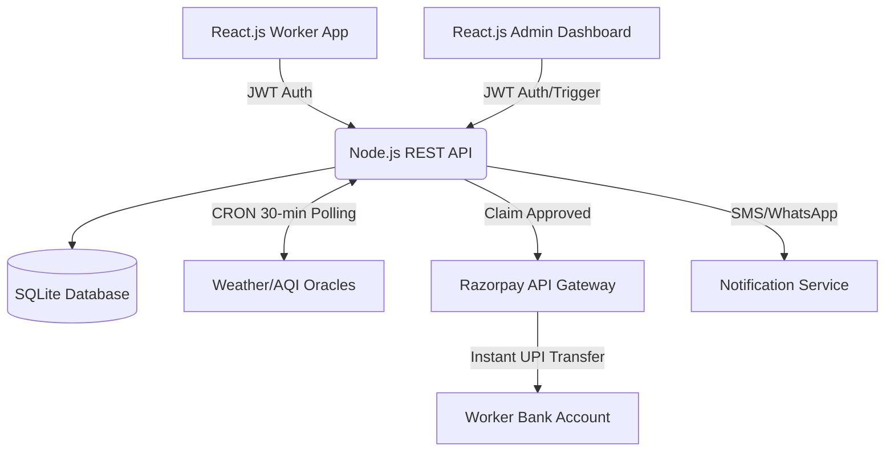

# GigShield: AI-Powered Parametric Insurance for India's Gig Economy

GigShield is a production-ready, zero-touch parametric insurance platform custom-built for India's food delivery partners (Zomato/Swiggy). It protects gig workers from income loss caused by weather disruptions, severe air pollution, and municipal lockdowns, ensuring immediate automated payouts without filing a manual claim.

## 👥 Persona & Scenarios
**Target User**: Rajesh, a Zomato delivery partner in Chennai earning ₹3,500/week. 
**The Problem**: When heavy monsoons flood Chennai, Rajesh cannot deliver food. He loses out on daily wages and receives no compensation from platforms.
**The Solution**: With GigShield, Rajesh pays a small weekly premium (e.g., ₹49/week). When the meteorological department flags >50mm of rainfall, GigShield automatically intercepts the trigger and instantly deposits ₹175 to Rajesh's UPI—protecting his day's earnings without him ever opening the app to file a claim.

## 💸 Weekly Premium Model
Insurance pricing is inherently dynamic and calculated weekly based on an AI-driven predictive model.
- **Basic Tier**: ₹29/week → covers up to ₹500 income loss
- **Standard Tier**: ₹49/week → covers up to ₹1,000 income loss
- **Premium Tier**: ₹79/week → covers up to ₹2,000 income loss

**AI Dynamic Adjustments**:
- Zone flood/heat history: +10% to +25%
- Current 7-day weather forecast risk: +5% to +20%
- Worker claim history (0 claims = -10% loyalty discount)
- City AQI > 300 = +15% (severe pollution week)

## ⚡ Parametric Triggers
Claims are 100% automated using third-party oracles (APIs). No manual intervention is needed.
1. **Heavy Rain**: Rainfall > 10mm/day (OpenWeatherMap API) → 50% daily wage payout.
2. **Extreme Heat**: Temps > 42°C (OpenWeatherMap API) → 30% daily wage payout.
3. **Severe Air Pollution**: AQI > 150 (OpenAQ API) → 40% daily wage payout.
4. **Flood / Natural Disaster**: IMD Red Alert → 100% weekly coverage amount.
5. **Curfew / Social Disruption**: Admin manual trigger for app outages or strikes → 100% daily wage payout.

## 🧠 AI/ML Integration Details
1. **Dynamic Risk Profiler**: Evaluates live weather forecasts (via Open-Meteo) combined with a worker's city/zone to assign a real-time Risk Tier (Low/Medium/High) during onboarding.
2. **Fraud Detection Engine**: ML Rule-based system that scores every claim (0-100) before payout to prevent abuse.
   - Checks for duplicate trigger types in 24 hours.
   - Velocity limits (no more than 3 claims a week).
   - Income ratio check (payouts vs actual weekly earnings).
3. **Predictive Analytics**: The Admin Dashboard calculates exposure risks and visualizes claim probabilities based on 7-day API forecasts.

## 💻 Tech Stack & Architecture
* **Frontend**: React.js (Vite), Tailwind CSS, Chart.js, Lucide Icons.
* **Backend**: Node.js, Express.js.
* **Database**: SQLite (SQL) with automated indexing.
* **Integrations**: Open-Meteo API (Weather/AQI), Razorpay Test Mode (Payout Simulation).
* **Security**: JWT Authentication, bcrypt password hashing, Helmet.js.

### Architecture Diagram


## 🚀 Setup Instructions
1. **Clone the repo**
```bash
git clone <repo-url>
cd GigProtection
```
2. **Setup the Backend**
```bash
cd backend
npm install
node server.js
# Runs on Port 5000 and auto-seeds the SQLite DB with 5 dummy workers, policies, and mock claims.
```
3. **Setup the Frontend**
```bash
cd frontend
npm install
npm run dev
# Runs on Port 5173
```
4. **Login Credentials**:
- **Worker Login**: Phone: `9876543210` / Password: `password`
- **Admin Login**: Phone: `admin` / Password: `admin`

## 🎥 Hackathon Demo Flow
1. **Register**: Sign up a new worker to view the AI Risk Profiling model dynamically select a Tier.
2. **Dashboard**: View the Worker Dashboard displaying their active policy, earnings protected, and local weather risks.
3. **Admin Trigger**: Switch to the Admin Dashboard and broadcast a "Social Disruption" event for Chennai.
4. **Zero-Touch Claim**: The backend handles the event automatically, generates the claim, evaluates fraud, simulates the Razorpay payout, and fires a WhatsApp notification to the console.
5. **Worker Receipt**: The worker visits their dashboard to see the Auto-Approved claim and can download the simulated UPI receipt.
